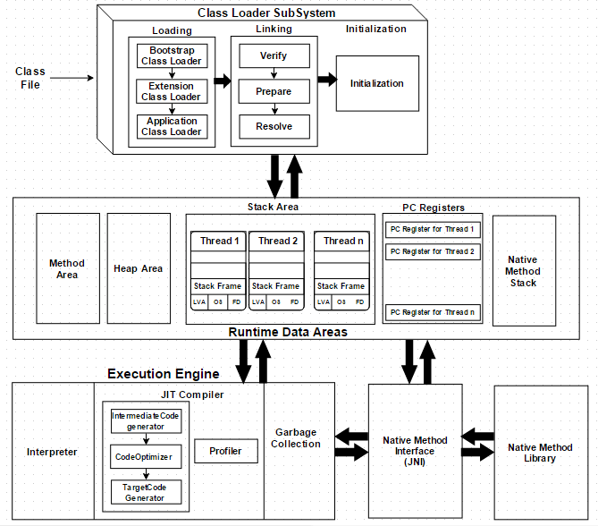

### JVM Architecture (Java Virtual Machine)
The Java Virtual Machine (JVM) is the engine that **runs** Java applications. It converts Java **bytecode** into **machine** code for execution. JVM ensures that Java is platform-independent, secure, and efficient.

## JVM Achitecture diagram

### Components of jvm

**Component**	D**escription**
*Class Loader*	              Loads .class files (bytecode) into JVM
*Bytecode Verifier*	          Ensures code is valid and doesn't violate JVM rules
*Method Area	Stores*       class-level data like method names, static variables
*Heap*	                      Memory for objects and instance variables
*JVM Stack*	                  Manages method calls and local variables per thread
*PC Register*	              Keeps track of the current executing instruction
*Execution Engine*	          Runs the bytecode using interpreter or JIT compiler
*JNI (Java Native Interface)* Connects Java with C/C++ native code
*Native Libraries*	          OS-specific code needed for full execution

## Memory Management:
    Memory management in Java refers to the process of allocating, using, and reclaiming memory during the execution of a Java program. Java handles memory automatically using its Java Virtual Machine (JVM), which ensures that memory is used efficiently without requiring the programmer to manually allocate or deallocate memory.

>>Java memory is divided into specific regions: Heap, Stack, Method Area, PC Register, and Native Method Stack.

>>Objects and class instances are created in the Heap.

>>Local variables and method calls are managed in the Stack.

>>Java uses Garbage Collection to automatically free memory that is no longer in use.

>>This automated system helps developers avoid memory leaks and segmentation faults common in other languages like C or C++.